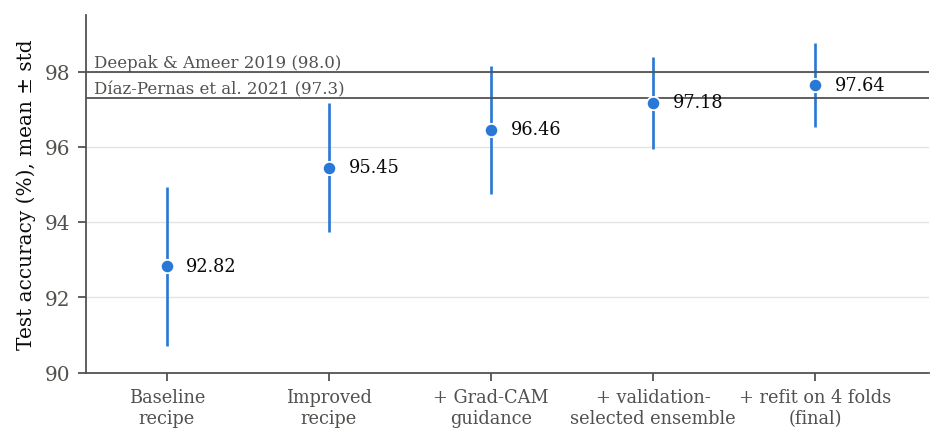

# Brain Tumor MRI Classification with Grad-CAM-Guided Training

Leakage-free brain tumor classification (glioma, meningioma, pituitary tumor) on the Figshare CE-T1 MRI dataset,
with Grad-CAM explainability, Grad-CAM-guided training, tumor-region classifiers and Mask R-CNN segmentation.

**Result (official patient-wise 5-fold CV, 3 classes):** **97.64 ± 1.12 %** test accuracy (pooled 97.58 %, macro-F1
97.24 %), above the closest published work on the same dataset and protocol (Díaz-Pernas et al. 2021: 97.3 %) and
0.4 points below Deepak & Ameer 2019 (98 %). The ensemble was chosen on validation folds only.

| | Test accuracy (%) | Protocol |
|---|---|---|
| Cheng et al. 2015 [2] | 91.28 | patient-wise 5-fold |
| Díaz-Pernas et al. 2021 [5] | 97.3 | patient-wise 5-fold |
| Deepak & Ameer 2019 [4] | 98.0 | patient-level 5-fold |
| **This work: single EfficientNet-B3, Grad-CAM-guided** | **97.01** (mean of 3 seeds; best seed 97.21 ± 1.15) | patient-wise 5-fold |
| **This work: final ensemble** | **97.64 ± 1.12** | patient-wise 5-fold |

The technical report is [report/report.pdf](report/report.pdf); every number below is stored in [results/](results/)
(see [results/README.md](results/README.md)).

---

## Contents

- [Repository layout](#repository-layout)
- [Data](#data)
- [Protocol](#protocol)
- [Method](#method)
- [Results](#results)
- [Explainability (Grad-CAM)](#explainability-grad-cam)
- [Segmentation](#segmentation)
- [How to run](#how-to-run)
- [Limitations](#limitations)
- [References](#references)

## Repository layout

```
├── scripts/
│   ├── prepare_data.py          # .mat → JPEG + PNG masks, metadata.csv (patient IDs, official folds)
│   ├── common.py                # data, ROI crops, models, recipes, training/eval utilities
│   ├── train_classifier.py      # patient-level CV, Grad-CAM-guided loss, EMA, ROI crops, refit mode
│   ├── train_maskrcnn.py        # Mask R-CNN, patient-level CV
│   ├── predict_boxes.py         # out-of-fold Mask R-CNN boxes for the tumor-region classifier
│   ├── select_ensemble.py       # validation-only model/ensemble selection; scoring of fixed ensembles
│   ├── gradcam_analysis.py      # Grad-CAM + localisation metrics against tumor masks
│   ├── summarize.py             # tables → results/summary.md
│   └── make_report_figures.py   # figures of the report
├── results/                     # per-run JSON (config, history, val/test probabilities), selections, Grad-CAM
├── report/                      # LaTeX technical report (report.tex, figures/, report.pdf)
├── streamlit_app.py             # two-stage inference app with Grad-CAM
└── requirements.txt
```

Not versioned (`.gitignore`): `Brain-Tumor-Dataset/`, `checkpoints/`, virtual environments.

### Model weights

Trained weights are not stored in the repository. Download link: **_to be added (Google Drive)_**. Unpack into
`checkpoints/`:

```
checkpoints/
├── final_ensemble/refit_{effb3_full,incv3_full,effb3_roi2}_s{42,1,2}/fold{1..5}/*.pt   # final 97.64 % ensemble (2.6 GB)
├── seg_cv/fold{1..5}/mask_rcnn_tumor_best.pth                                        # Mask R-CNN per fold (crops for the ROI models)
├── classifier/EfficientNet_B3_gradcam_guided.pt                                      # Streamlit app classifier (4-class)
└── mask_rcnn_tumor_best.pth                                                          # Streamlit app segmenter (= seg_cv fold 1)
```

For CV fold *k*, use the `fold<k>` models only on that fold's test patients.

## Data

| Part | Source | Images |
|---|---|---|
| glioma / meningioma / pituitary, masks, patient IDs, CV folds | Figshare brain tumor dataset [1, 2] | 1426 / 708 / 930 slices, **233 patients**, 512×512 CE-T1, official `cvind.mat` folds |
| no tumor (4-class experiments only) | `Training/no_tumor` of the Kaggle "Brain Tumor Classification (MRI)" set [6] | 395 |

[scripts/prepare_data.py](scripts/prepare_data.py) converts the `.mat` files to JPEG (min-max scaling from the
Figshare README), writes the masks as PNG and builds `metadata.csv`.

## Protocol

* **Official patient-wise 5-fold CV** (`cvind.mat`), the protocol of [2, 4, 5]. All 3064 slices are tested exactly once,
  and no patient appears in both training and test.
* **Selection on validation only.** In development runs fold *k* is the test fold and fold *k*+1 the validation fold.
  Epochs, configurations and the ensemble were chosen on pooled validation accuracy. The final models were then
  **refit** on all four non-test folds (80 % of the data, like the published works) for the fixed schedule and evaluated
  once on the test fold.
* **Why not a random image split?** The dataset has ~13 near-identical slices per patient, so shuffling slices puts
  the same patient in training and test. In an earlier image-level 70/15/15 version of this project InceptionV3 reached
  97.7 %; under patient-level evaluation the same model reaches 92.8 %. No result here uses an image-level split.

## Method

1. **Training recipe** ([scripts/common.py](scripts/common.py), `improved`): ImageNet-pretrained CNN, MRI-plausible
   augmentation (flip, ±15° / ±10 % affine, brightness/contrast/gamma), AdamW (lr 2e-4, wd 0.05), batch 32, 30 epochs
   with warm-up + cosine, label smoothing 0.1, bf16, horizontal-flip TTA, EfficientNet-B3 at its native 300 px.
2. **Grad-CAM-guided training** ([scripts/train_classifier.py](scripts/train_classifier.py), `--attn-weight 1`): the
   Grad-CAM of the true class is computed differentiably during training and the loss
   `CE + λ·(1 − CAM-mass inside the dilated tumor mask)` pushes the network to base its decision on the tumor and
   its surroundings. Masks are used only for training; inference needs none.
3. **Tumor-region classifier** (`--roi-context 2`): a second EfficientNet-B3 sees a square crop of twice the tumor
   size around the tumor. Training crops come from the ground-truth mask (random jitter); validation/test crops from
   the **out-of-fold** Mask R-CNN box of the same fold ([scripts/predict_boxes.py](scripts/predict_boxes.py)).
4. **Ensemble** ([scripts/select_ensemble.py](scripts/select_ensemble.py)): every subset of configurations (each trained
   with 3 seeds) is scored by pooled validation accuracy of the uniform average. The selected subset was
   EfficientNet-B3 (full image) + InceptionV3 (full image) + EfficientNet-B3 (tumor region), 9 models in total.
5. **Refit** (`--refit`): the 9 selected models are retrained on the 4 non-test folds and averaged.

## Results

All numbers: test accuracy (%), mean ± std over the 5 patient-wise folds, 3 classes.

### Progression

| Step | Model | Training data | Test accuracy |
|---|---|---|---|
| Baseline recipe (AdamW, resize only, 15 epochs) | InceptionV3 | 3 folds | 92.82 ± 2.12 |
| Improved recipe | EfficientNet-B3 | 3 folds | 95.45 ± 1.71 |
| + Grad-CAM guidance | EfficientNet-B3 | 3 folds | 96.46 ± 1.70 |
| + validation-selected ensemble (9 models) | EffNet-B3 + InceptionV3 + EffNet-B3 ROI | 3 folds | 97.18 ± 1.22 |
| **+ refit on 4 folds (final)** | same 9 models | 4 folds | **97.64 ± 1.12** |



### Ablations

Development runs (trained on 3 folds; validation = pooled accuracy over the 5 validation folds).

| Configuration (all Grad-CAM-guided unless noted) | Validation | Test |
|---|---|---|
| EfficientNet-B3, 300 px (seeds 42 / 1 / 2) | 97.13 / 96.93 / 96.90 | 96.46 / 96.35 / 96.30 |
| EfficientNet-B3, 300 px, **without guidance** | – | 95.45 ± 1.71 |
| EfficientNet-B3, 300 px, + EMA of weights | 96.34 | 96.19 ± 1.28 |
| EfficientNet-B3 / InceptionV3, **448 px** | – | 96.46 ± 1.85 / 96.09 ± 1.02 |
| InceptionV3, 299 px (seeds 42 / 1 / 2) | 96.41 / 96.80 / 96.61 | 96.03 / 96.65 / 95.53 |
| ConvNeXt-T, 384 px, EMA (seeds 42 / 1 / 2) | 97.10 / 97.13 / 97.00 | 96.17 / 96.65 / 96.24 |
| EfficientNetV2-S, 384 px, EMA (seeds 42 / 1 / 2) | 96.48 / 96.54 / 96.61 | 96.62 / 96.11 / 96.06 |
| Tumor-region EfficientNet-B3, context 2× (seeds 42 / 1 / 2) | 95.20 / 95.01 / 94.35 | 94.42 / 93.78 / 93.94 |
| Tumor-region EfficientNet-B3, context 3× | 94.81 | 94.06 ± 1.93 |
| Tumor-region ConvNeXt-T, context 2× | 94.45 | 94.11 ± 1.29 |

Ensembles and refit:

| | Validation | Test |
|---|---|---|
| EffNet-B3 + InceptionV3 (6 models, 3 folds) | 97.26 | – |
| **+ tumor-region EffNet-B3 (9 models, 3 folds) — selected** | **97.78** | 97.18 ± 1.22 |
| Refit, EfficientNet-B3 only (3 seeds) | – | 97.14 ± 0.99 |
| Refit, InceptionV3 only (3 seeds) | – | 96.99 ± 1.17 |
| Refit, tumor-region EffNet-B3 only (3 seeds) | – | 94.54 ± 0.92 |
| Refit, without tumor-region models (6 models, ablation) | – | 97.37 ± 1.05 |
| **Refit, selected 9-model ensemble (final)** | – | **97.64 ± 1.12** |

What the ablations show:

* **Grad-CAM guidance is the largest single-model gain** after the recipe: +1.0 to +1.3 points for EfficientNet-B3
  and InceptionV3 (see [Explainability](#explainability-grad-cam)).
* **Bigger backbones did not help.** ConvNeXt-T and EfficientNetV2-S at 384 px, EMA weights and 448 px inputs all
  stay within ±0.5 points of EfficientNet-B3 at 300 px.
* **Tumor-region models are weak alone but complementary.** They see the lesion magnified 2–5× and make different
  errors; adding them raises the ensemble by +0.5 (validation) and +0.3 (test).
* **More training data helps every configuration.** Refitting on 4 instead of 3 folds adds +0.35 to +0.65 points per
  configuration and +0.46 to the ensemble — the published works also train on 80 % of the data.

### Per-class recall (pooled over folds)

| | Glioma | Meningioma | Pituitary |
|---|---|---|---|
| Baseline recipe, EfficientNet-B3 | 0.907 | 0.818 | 0.969 |
| Improved recipe, EfficientNet-B3 | 0.968 | 0.895 | 0.977 |
| + Grad-CAM guidance | 0.978 | 0.922 | 0.984 |
| **Final ensemble** | **0.985** | **0.941** | **0.988** |
| Díaz-Pernas et al. [5] | 0.99 | 0.93 | 0.98 |

### 4 classes (with no tumor)

Adding the 395 Kaggle healthy scans, the guided 3-CNN ensemble (AlexNet, InceptionV3, EfficientNet-B3, trained on 3 folds)
reaches **96.84 ± 1.04 %**; healthy scans are recognised with 0.99–1.00 recall in every setting, which is partly a
dataset shortcut (see below). Full tables: [results/summary.md](results/summary.md) (`cv4_*`).

## Explainability (Grad-CAM)

[scripts/gradcam_analysis.py](scripts/gradcam_analysis.py) computes the Grad-CAM of the predicted class at the last
convolutional block for every test image and scores it against the tumor mask: **pointing game** (CAM maximum inside
the tumor), **energy in tumor** (share of CAM mass on the tumor; a uniform map scores 0.017), **CAM-IoU**, and the
share of CAM mass inside the head on healthy scans.

| Model (patient-level CV) | Recipe | Pointing | Energy in tumor | CAM-IoU |
|---|---|---|---|---|
| InceptionV3 (4-class) | baseline | 0.271 | 0.047 | 0.069 |
| InceptionV3 (4-class) | improved | 0.460 | 0.081 | 0.136 |
| InceptionV3 (4-class) | **+ guidance** | **0.814** | **0.323** | **0.216** |
| EfficientNet-B3 (4-class) | baseline | 0.161 | 0.048 | 0.061 |
| EfficientNet-B3 (4-class) | improved | 0.259 | 0.094 | 0.129 |
| EfficientNet-B3 (4-class) | **+ guidance** | **0.910** | **0.447** | **0.233** |
| EfficientNet-B3, final refit (3-class) | + guidance | 0.898 | 0.449 | 0.231 |
| InceptionV3, final refit (3-class) | + guidance | 0.814 | 0.334 | 0.217 |

1. **Unguided models are right for the wrong reasons:** only 3–9 % of their Grad-CAM mass lies on the tumor and the
   CAM peak hits the tumor in 12–46 % of cases; decisions are often explained by skull, orbits or background.
2. **Better accuracy does not mean better grounding:** the improved recipe adds ~3 accuracy points but pointing rises
   only from 0.27 to 0.46 (InceptionV3).
3. **Shortcut on the healthy class:** on healthy scans 20–52 % of the CAM mass lies outside the head. Those scans come
   from another source and include T2/FLAIR, whereas all tumor slices are CE-T1.
4. **Guidance fixes localisation and improves accuracy:** pointing 0.26 → 0.91 (EfficientNet-B3), +1.0 to +1.3 accuracy
   points (3 classes), meningioma recall 0.895 → 0.922, and the final refit models keep the localisation.
5. **The first version of the loss had a loophole:** written as *outside/total*, it was satisfied by an all-zero CAM,
   which AlexNet learned (blank Grad-CAMs, loss ≈ 0). The released loss *1 − inside/total* makes a blank map the worst
   case. (The early `cv3_attn` / `cv4_attn` InceptionV3/EfficientNet-B3 runs used the first form; all `p3_*` and
   `refit_*` runs use the released one.)

Figures: [results/gradcam/](results/gradcam/) — e.g.
[before](results/gradcam/cv4_improved/figures/cv4_improved_fold1_EfficientNet_B3.png) vs
[after guidance](results/gradcam/cv4_attn/figures/cv4_attn_fold1_EfficientNet_B3.png).

## Segmentation

Mask R-CNN (ResNet-50 FPN, COCO init), binary tumor mask, patient-level 5-fold CV (best epoch by validation Dice,
score threshold by validation F1). Misses count as IoU = Dice = 0; specificity is on the 395 healthy scans.

| Threshold | Precision | Recall | Specificity | F1 | Mean IoU | Mean Dice |
|---|---|---|---|---|---|---|
| 0.4 | 0.967 ± 0.006 | 0.955 ± 0.008 | 0.749 ± 0.058 | 0.961 ± 0.002 | 0.682 ± 0.022 | 0.757 ± 0.020 |
| 0.3 (tuned on validation) | 0.958 ± 0.008 | 0.967 ± 0.005 | 0.673 ± 0.075 | 0.963 ± 0.004 | 0.686 ± 0.021 | **0.763 ± 0.020** |

Díaz-Pernas et al. [5] report Dice 0.828 with a multiscale pixel-classification CNN, so segmentation is the stage
with the larger gap to the literature. Its out-of-fold boxes feed the tumor-region classifier.

## How to run

```bash
pip install -r requirements.txt     # CUDA build: pip install torch torchvision --index-url https://download.pytorch.org/whl/cu130

# 1. data: Figshare .mat files in <root>/raw/mats, cvind.mat in <root>/raw, Bhuvaji et al. dataset in <root>/raw/sartaj
python scripts/prepare_data.py --root /data/mri
export MRI_ROOT=/data/mri
G="--recipe improved --split patient --classes 3 --attn-weight 1.0"

# 2. segmentation and out-of-fold boxes
python scripts/train_maskrcnn.py --exp seg_cv --split patient --folds 1 2 3 4 5 --epochs 20 --batch-size 8 --select dice
python scripts/predict_boxes.py

# 3. development runs (3 folds train, 1 validation, 1 test) — repeat with --seed 1 / 2 and suffix _s1 / _s2
python scripts/train_classifier.py $G --exp p3_full_effb3 --models EfficientNet_B3
python scripts/train_classifier.py $G --exp p3_full_incv3 --models InceptionV3
python scripts/train_classifier.py $G --exp p3_roi2_effb3 --models EfficientNet_B3 --roi-context 2.0
python scripts/train_classifier.py $G --exp p3_convnext384_ema --models ConvNeXt_T --image-size 384 --attn-dilate 41 --ema 0.998
python scripts/train_classifier.py $G --exp p3_effv2s384_ema --models EfficientNetV2_S --image-size 384 --attn-dilate 41 --ema 0.998

# 4. choose the ensemble on validation
python scripts/select_ensemble.py --out selection/sel_groups_val.json --groups \
    effb3_full=p3_full_effb3,p3_full_effb3_s1,p3_full_effb3_s2 incv3_full=p3_full_incv3,p3_full_incv3_s1,p3_full_incv3_s2 \
    effb3_roi2=p3_roi2_effb3,p3_roi2_effb3_s1,p3_roi2_effb3_s2 \
    convnext384_ema=p3_convnext384_ema,p3_convnext384_ema_s1,p3_convnext384_ema_s2 \
    effv2s384_ema=p3_effv2s384_ema,p3_effv2s384_ema_s1,p3_effv2s384_ema_s2

# 5. refit the selected configurations on 4 folds (seeds 42, 1, 2) and score the fixed ensemble
for s in 42 1 2; do
  python scripts/train_classifier.py $G --refit --seed $s --exp refit_effb3_full_s$s --models EfficientNet_B3
  python scripts/train_classifier.py $G --refit --seed $s --exp refit_incv3_full_s$s --models InceptionV3
  python scripts/train_classifier.py $G --refit --seed $s --exp refit_effb3_roi2_s$s --models EfficientNet_B3 --roi-context 2.0
done
python scripts/select_ensemble.py --out selection/refit_ensemble.json --score \
    refit_effb3_full_s42 refit_effb3_full_s1 refit_effb3_full_s2 refit_incv3_full_s42 refit_incv3_full_s1 \
    refit_incv3_full_s2 refit_effb3_roi2_s42 refit_effb3_roi2_s1 refit_effb3_roi2_s2

# 6. Grad-CAM analysis, tables, report figures
python scripts/gradcam_analysis.py --models EfficientNet_B3 --out gradcam/refit_effb3_full_s42 \
    --tags refit_effb3_full_s42/fold1 refit_effb3_full_s42/fold2 refit_effb3_full_s42/fold3 refit_effb3_full_s42/fold4 refit_effb3_full_s42/fold5
python scripts/summarize.py --cls p3_full_effb3 refit_effb3_full_s42 --seg seg_cv
python scripts/make_report_figures.py
```

Hardware used: one NVIDIA RTX PRO 5000 (48 GB). An EfficientNet-B3 fold takes ~5 min, ConvNeXt-T at 384 px ~8 min,
a Mask R-CNN fold ~30 min.

### Streamlit app

```bash
streamlit run streamlit_app.py
```

Expects `checkpoints/classifier/EfficientNet_B3_gradcam_guided.pt` (4-class guided EfficientNet-B3, `cv4_attn`
fold 1) and `checkpoints/mask_rcnn_tumor_best.pth` (`seg_cv` fold 1); both hold out patient-wise fold 1. The app shows
the class probabilities, the predicted mask and box, the Grad-CAM of the predicted class and, for `.mat` input, the
IoU with the ground truth.

## Limitations

* **Margins are within the noise.** The final ensemble is +0.34 points above [5] and −0.36 below [4]; the fold-to-fold
  standard deviation is ±1.1 points, so the result is *on par with* the best published work, not decisively better.
* **Selection hygiene.** The ensemble rule and its members were fixed on validation folds before the refit was trained,
  but test accuracies of development candidates were printed alongside validation accuracies during development.
* The healthy class (4-class experiments) comes from another source and partly other MRI sequences.
* 2D slices only; no external test set; no clinical validation.

## References

1. J. Cheng. *Brain tumor dataset.* figshare (dataset 1512427, v8). https://doi.org/10.6084/m9.figshare.1512427
2. J. Cheng, W. Huang, S. Cao, R. Yang, W. Yang, Z. Yun, Z. Wang, Q. Feng. Enhanced performance of brain tumor
   classification via tumor region augmentation and partition. *PLoS ONE* 10(10): e0140381, 2015.
3. J. Cheng et al. Retrieval of brain tumors by adaptive spatial pooling and Fisher vector representation.
   *PLoS ONE* 11(6): e0157112, 2016.
4. S. Deepak, P. M. Ameer. Brain tumor classification using deep CNN features via transfer learning.
   *Computers in Biology and Medicine* 111: 103345, 2019.
5. F. J. Díaz-Pernas, M. Martínez-Zarzuela, M. Antón-Rodríguez, D. González-Ortega. A deep learning approach for brain
   tumor classification and segmentation using a multiscale convolutional neural network. *Healthcare* 9(2): 153, 2021.
6. S. Bhuvaji, A. Kadam, P. Bhumkar, S. Dedge, S. Kanchan. Brain Tumor Classification (MRI). Kaggle, 2020.
7. R. R. Selvaraju et al. Grad-CAM: Visual explanations from deep networks via gradient-based localization. *ICCV* 2017.
8. A. S. Ross, M. C. Hughes, F. Doshi-Velez. Right for the right reasons: training differentiable models by
   constraining their explanations. *IJCAI* 2017.
9. R. Caruana, A. Niculescu-Mizil, G. Crew, A. Ksikes. Ensemble selection from libraries of models. *ICML* 2004.
10. K. He, G. Gkioxari, P. Dollár, R. Girshick. Mask R-CNN. *ICCV* 2017.
11. M. Tan, Q. Le. EfficientNet: Rethinking model scaling for convolutional neural networks. *ICML* 2019.
12. M. Tan, Q. Le. EfficientNetV2: Smaller models and faster training. *ICML* 2021.
13. Z. Liu, H. Mao, C.-Y. Wu, C. Feichtenhofer, T. Darrell, S. Xie. A ConvNet for the 2020s. *CVPR* 2022.
14. C. Szegedy et al. Rethinking the Inception architecture for computer vision. *CVPR* 2016.
